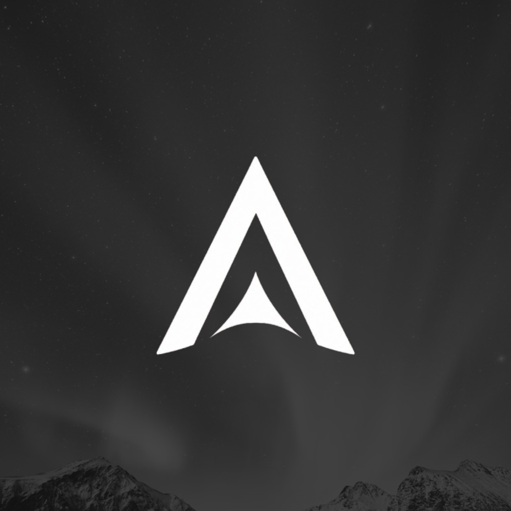

<p align="center">
  
</p>

<h1 align="center">Argon OS</h1>

<p align="center">
  <b>Privacy first. Security by default.</b><br/>
  A hardened, privacy-focused <b>desktop</b> Linux distribution built on Kali rolling, developed in Norway.
</p>

<p align="center">
  
  
  
  
  
</p>


---

## Why Argon?

Argon is a **privacy-focused desktop operating system** built on Kali Linux.
Rather than targeting penetration testing alone, it provides a hardened,
developer-friendly environment with **secure defaults, integrated privacy
tools, and a polished desktop experience**.

It's *not* "Kali with a different wallpaper." Kali is a professional
pentesting platform that expects you to configure it. Argon takes Kali's
excellent package base and turns it into an OS a privacy-conscious person
can install and use on day one, firewall already up, DNS already
encrypted, telemetry never present, and a real software center instead of
the terminal. The full Kali toolset stays one `apt install` away, but
nothing is preinstalled and nothing listens by default.

## How it compares

| | Kali | Ubuntu | **Argon** |
| --- | :---: | :---: | :---: |
| Privacy hardening by default (encrypted DNS, MAC randomization) | ❌ | ❌ | ✅ |
| Firewall enabled out of the box | ❌ | ❌ | ✅ |
| Telemetry | None | Some | **None** |
| Automatic security updates | Manual | ✅ | ✅ |
| Full-disk encryption in the installer | ✅ | ✅ | ✅ |
| Graphical software center (no terminal) | ❌ | ✅ | ✅ |
| Security / research tool ecosystem | ✅ | ❌ | ✅ *(Kali repos)* |
| Beginner-friendly | ❌ | ✅ | ✅ |
| Focus | Pentesting | General desktop | **Privacy desktop** |

## What you get out of the box

Concrete, verifiable defaults, every one of these is active on a fresh
install with zero configuration:

| | Default |
| --- | --- |
| Telemetry | **None.** |
| Firewall | UFW enabled, deny incoming , allow outgoing |
| MAC address | Randomized while scanning, per-network stable when connected |
| DNS | DNS-over-TLS Quad9/Mullvad, DNSSEC, no mDNS/LLMNR |
| Browser | Firefox ESR with telemetry off, tracking protection is strict, HTTPS-only, uBlock Origin |
| Mandatory access control | AppArmor enforced |
| Updates | Security updates applied automatically, reboots never forced |
| Brute-force protection | fail2ban (sshd jail) |
| Time | chrony with authenticated NTS |
| Network services | Zero listening, ssh/tor/cups installed but opt-in |
| Kernel | Hardened sysctl baseline |
| Disk encryption | LUKS2 full-disk encryption |
| Desktop | XFCE, low memory footprint |

Verify any of them yourself and see [docs/hardening.md](docs/hardening.md)
and [docs/privacy.md](docs/privacy.md).

## Built by Argon

Argon isn't a re-skin and these components are original to the project:

- ✅ **Argon Welcome** — first-login greeter (install, get software, review privacy defaults)
- ✅ **Argon Software** — graphical app store with curated categories and one-click, polkit-authenticated installs
- ✅ **Argon Virtual Audio** — Voicemeeter-style virtual audio cables on PipeWire
- ✅ **Argon branding** — logo, wallpapers, Plymouth boot theme, branded GRUB/isolinux boot menu
- ✅ **Installer customization** — Calamares with a LUKS2 + Btrfs guided default and a sudo-only, no-root user model
- ✅ **Desktop theme & layout** — dark custom XFCE, not stock XFCE
- ✅ **Security & privacy defaults** — the full hardening stack above
- ✅ **Package repository** — signed APT repo + `argon-*` metapackages
- ✅ **Reproducible build pipeline** — scripted live-build + CI that produces the ISO

More detail in [docs/applications.md](docs/applications.md).

## Install in four steps

```
①  Download the ISO   →   ②  Flash to USB (Etcher)   →   ③  Boot it   →   ④  Click "Install Argon OS"
```

The live session boots **straight to the desktop**, no login screen and
an **Install Argon OS** icon is right there on the desktop when you're
ready. No prior Linux experience, no terminal, no Kali required.

- **New to Linux?** → [Getting Started guide](docs/getting-started.md)
- **Detailed install** → [Installation guide](docs/installation.md)
- **Verify your download** → [reproducible builds](docs/reproducible-builds.md#verifying-a-release-current-state)

Grab an ISO from the [releases page](https://github.com/seattlex/argon/releases)
(weekly rolling snapshots + versioned releases).


## Roadmap

**Shipped**

- ✔ live-build ISO pipeline (UEFI + BIOS) with CI
- ✔ Argon Welcome, Argon Software, Argon Virtual Audio
- ✔ Custom installer (LUKS2 + Btrfs), branding & boot menu
- ✔ Privacy & security defaults, signed APT repo

**Upcoming**

- ◻ Secure Boot support
- ◻ Automatic Btrfs snapshots (rollback a bad update)
- ◻ Flatpak + sandboxed applications
- ◻ Wayland session
- ◻ Additional desktop editions (KDE, minimal) and ARM builds

Full plan: [docs/roadmap.md](docs/roadmap.md).

## Build it yourself

Everything on a shipped image is generated from this repository:

```sh
# on Kali rolling (or a privileged kalilinux/kali-rolling container)
sudo apt install live-build git
sudo ./scripts/build-iso.sh --variant xfce --version dev
```

Full instructions: [docs/building.md](docs/building.md).

## Repository map

```
build/       live-build configuration (the OS is defined here)
             └ bootloaders/  branded GRUB (UEFI) + isolinux (BIOS) menus
installer/   Calamares installer configuration and branding
packages/    Argon apps (Software + Welcome + Virtual Audio) + metapackages + APT repo
branding/    logo, plymouth boot theme, boot-menu splash
wallpapers/  desktop and login backgrounds
scripts/     build, sign, and repo-management entry points
docs/        documentation + screenshots
ci/          lint suite
website/     static project page
```

## Principles

1. **Privacy first** — data minimization in every default.
2. **Security by default** — hardened without user intervention.
3. **Freedom** — FOSS-first, GPL-3.0, no lock-in.
4. **Transparency** — public scripts, reproducible builds, signed releases.

The full product vision lives in the
[project documentation](docs/README.md).

## Community & contributing

Argon is young and contributions shape it.

- 💬 **Questions & ideas** → [GitHub Discussions](https://github.com/seattlex/argon/discussions)
- 🐛 **Bugs & requests** → [open an issue](https://github.com/seattlex/argon/issues/new/choose)
- 🛠 **Contributing** → [CONTRIBUTING.md](CONTRIBUTING.md)
- 🔒 **Security issues** → [SECURITY.md](SECURITY.md) (please read first)

## License

GPL-3.0-or-later. See [LICENSE](LICENSE). Named for the noble gas argon:
stable, non-reactive, invisible.
